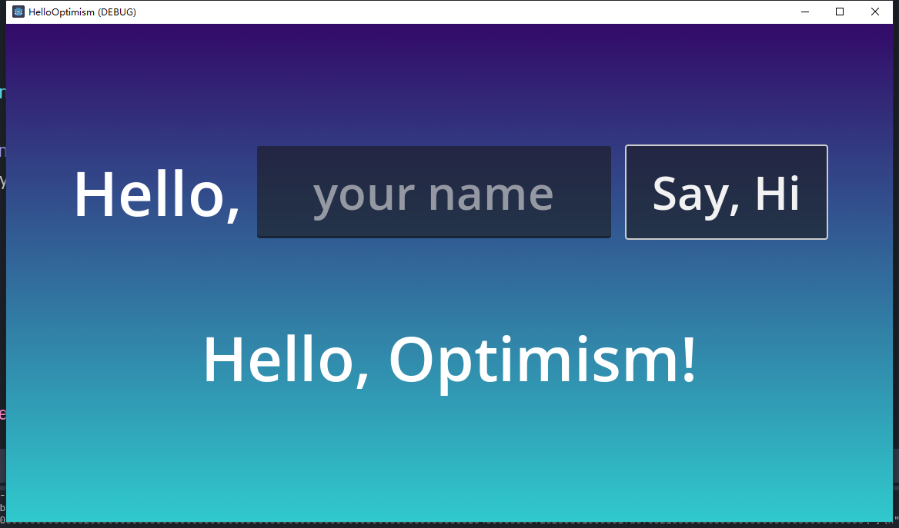
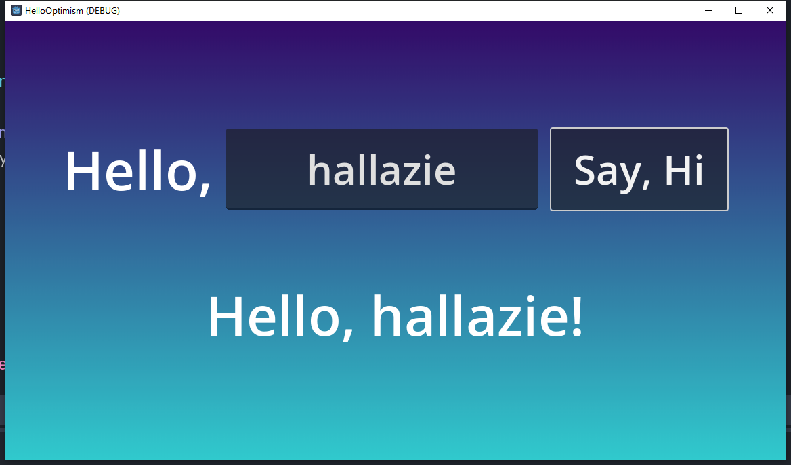

# HelloOptimism

This is a `Hello World!` demo for our GDScript-Web3 module, showcasing the ability to interact with Optimism using GDScript.

This demo including a call function and a transaction function for a simple contract.

GDScript-Web3 module repo: https://github.com/qingfengzxr/gdscript-web3

Documentation: https://gdweb3-docs.readthedocs.io/en/latest/getting_started.html

A more complexing demo: https://github.com/hallazie/TetrisDemo

## Call Function

If username is empty, button clicking will call `callHello` function in the contract, and return a default `Hello, Optimism!` from the contract.

## Transaction Function

If username is set, button clicking will call `sendHello` function in the contract first, with the transaction body containing your `username` and your `privateKey`. Then it will call `whoami` function to get the previously sent username from the contract with the address converted from the privateKey.

The `privateKey` is set in the main scene with the parameter `PrivateKey`.

